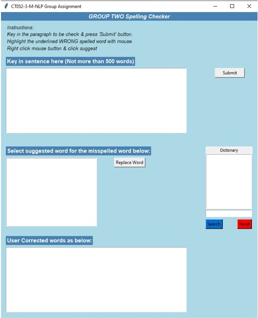

# Spell_Corrector_System_NLP
Created NLP rules-based programming based on noisy channel model for spell correction system that has the ability to performed spelling error detection and spell correction. Applying various technique such as text preprocessing (regex, parsing, tokenizing), feature extraction (word count), advance text processing (n-gram, TF-IDF) then developed language model together with channel(error) model from it. Finally provided GUI for user to use the system interactively. This system included error detection performance evaluation which evaluate the real word error and non word error.

| Package       | Description                                 |
| ------------- |:-------------------------------------------:|
| TKinter       | Standard library for Graphic User Interface |
| re            | Regular expression(RegEx) library           | 
| nltk          | Used for tokenizing & parsing string        |
| numpy         | Used for calculate multidimensional array   |
| pandas        | Used for Dataframe manipulation             |    

## Process Flow

## User Interface 
 
 

## Performance

 
 
